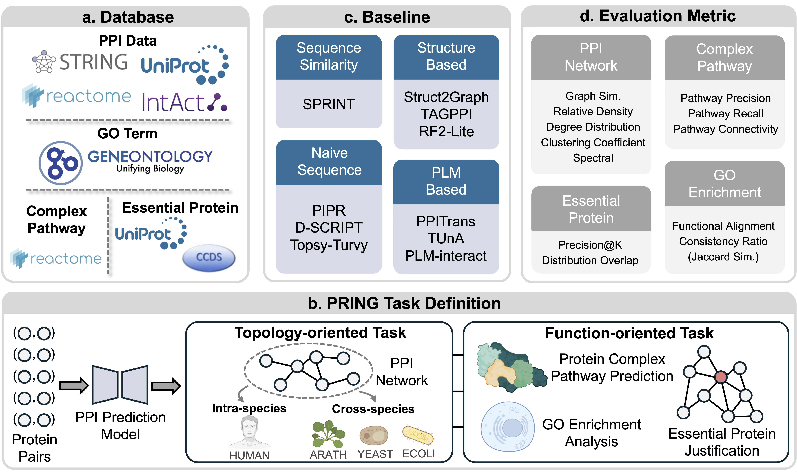

# PRING
This is the official codebase of the paper: **PRING: Rethinking Protein-Protein Interaction Prediction from Pairs to Graphs**



PRING contains two main tasks: **Topology-oriented Task** and **Function-oriented Task**.
- **Topology-oriented Task**: This task focuses on the prediction of protein-protein interaction (PPI) networks. It includes two sub-tasks: **Intra-species PPI Network Generation** and **Cross-species PPI Network Generation**.
- **Function-oriented Task**: This task focuses on evalution the reconstructed PPI networks from a functional perspective. It includes three sub-tasks: **Protein Complex Pathway Prediction**, **GO Enrichment Analysis**, and **Essential Protein Justification**.

---

## 1. Environment Setup

important libs: torch==2.0.1+cu118 (This is not mandatory, but recommended).

```bash
git clone https://github.com/SophieSarceau/PRING.git
cd PRING
conda create -n pring python=3.10
conda activate pring
bash install.sh
```

## 2. Data Preparation

You can download the data from [PRING - Harvard Dataverse](https://doi.org/10.7910/DVN/22AUPR) and place it in the `./pring_dataset` folder.

## 1. Topology-oriented Task
### 1.1 Intra-species PPI Network Generation (HUMAN)

To train the model, you need the following files under the `./pring_dataset/human` folder:
```
./pring_dataset/human/BFS/human_train_ppi.txt (train)
./pring_dataset/human/BFS/human_val_ppi.txt (validation)
./pring_dataset/human/BFS/human_all_test_ppi.txt (test)
./pring_dataset/human/human_simple.fasta (protein sequences)
```

The `human_all_test_ppi.txt` file contains all-against-all pairs to reconstruct the complete test graph.

To evaluate the model's performance under different sampling strategies, namely **BFS**, **DFS**, and **RANDOM WALK**, you may refer to the following file: `./graph_level_eval/eval.py`.
The evaluation metrics include **Graph Similarity**, **Relative Density**, **Degree Distribution (MMD)**, **Clutering Coefficient (MMD)**, **Spectral (MMD)**.
Take **BFS** as an example:
```
./pring_dataset/human/human_all_test_ppi_pred.txt (predicted all-against-all pairs)
./pring_dataset/human/human_test_graph.pkl (ground truth test graph)
./pring_dataset/human/human_BFS_sampled_nodes.pkl (BFS sampled subgraphs)
```
The file format of `human_all_test_ppi_pred.txt` should be like this:
```
uniprot_id1 uniport_id2 label
```
where `label` is 1 for positive samples and 0 for negative samples.

### 1.2 Cross-species PPI Network Generation (ARATH, YEAST, ECOLI)
For the cross-species PPI network generation, you need to use the model trained on the human PPI network to predict the PPI network of other species, including **Ecoli**, **Yeast**, and **Arath**.
Take **Arath** as an example, suppose you want to evaluate the model under **BFS** sampling strategy, you need the following files under `./pring_dataset/arath` folder:
```
./pring_dataset/arath/arath_all_test_ppi.txt (all-against-all pairs)
./pring_dataset/arath/arath_test_graph.pkl (ground truth test graph)
./pring_dataset/arath/arath_BFS_sampled_nodes.pkl (BFS sampled subgraphs)
```

The rest of the evaluation process is the same as the intra-species PPI network generation task.

## 2. Function-oriented Task

### 2.1 Protein Complex Pathway Prediction
In this task, we need to use the trained model on humans to construct the protein complex pathway.
You may find all the data files under `./pathway_data` folder.
Specifically, as shown below:
```bash
./pathway_data/complex_test_pairs.txt (used for model inference)
./pathway_data/complex_proteins.fasta (prot seqs)
./pathway_data/complex_graphs.pkl (ground truth complex graph)
```

To evaluate the model, please refer to the evaluation files `./pathway_eval/eval.py`.
The evaluation metrics include **Pathway Recall**, **Pathway Precision**, and **Pathway Connectivity**.

### 2.2 GO Enrichment Analysis
In this task, we conduct GO enrichment analysis on the reconstructed Human test PPI network.
You need the following files to complete the evaluation:
```
./pring_dataset/human/human_all_test_ppi_pred.txt (predicted all-against-all pairs)
./pring_dataset/human/human_test_graph.pkl (ground truth test graph)
```

For evaluation, please refer to `./enrichment_analysis/eval.py`.
The evaluation metrics include **Functional Alignment**, and **Consistency Ratio**.

### 2.3 Essential Protein Justification
In this task, we need to use the reconstructed Human test PPI network to justify the essential proteins from non-essential proteins.
Again, you need the following files to complete the evaluation:
```
./pring_dataset/human/human_all_test_ppi_pred.txt (predicted all-against-all pairs)
./pring_dataset/human/human_test_graph.pkl (ground truth test graph)
```

For evaluation, please refer to `./essential_protein/eval.py`.
The evaluation metrics include **Precision@K** and **Distribution Overlap**.
