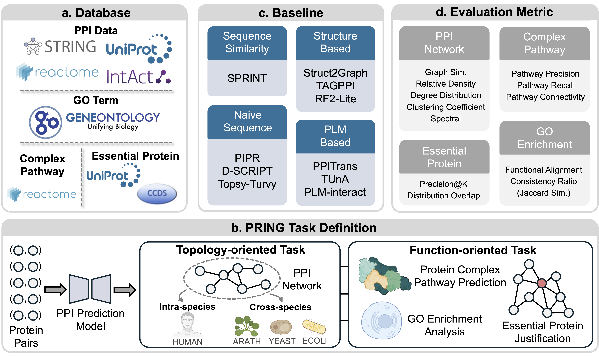

#  PRING: Rethinking Protein-Protein Interaction Prediction from Pairs to Graphs

<!-- # PRING: Rethinking Protein-Protein Interaction Prediction from Pairs to Graphs -->

This repository contains the official codebase for the paper:
[**PRING: Rethinking Protein-Protein Interaction Prediction from Pairs to Graphs**](https://arxiv.org/abs/2507.05101) (NeurIPS 2025)



---

## Introduction

**PRING** is a benchmark designed to evaluate protein–protein interaction (PPI) prediction methods beyond isolated pairs, shifting towards a **network-level perspective**.

It defines two major categories of tasks:

* **Topology-Oriented Tasks**: Evaluate the ability of models to reconstruct PPI networks.

  * **Intra-species PPI Network Generation**
  * **Cross-species PPI Network Generation**
* **Function-Oriented Tasks**: Assess the biological plausibility of reconstructed PPI networks.

  * **Protein Complex Pathway Prediction**
  * **GO Enrichment Analysis**
  * **Essential Protein Justification**

We hope this benchmark facilitates the development of **next-generation PPI prediction models** that capture the complex interplay of protein networks more effectively.

---

## Project Status

* [x] Data preprocessing pipeline (2025-09-19)
* [x] Evaluation code (2025-09-19)

---

## 1. Environment Setup

```bash
git clone https://github.com/SophieSarceau/PRING.git
cd PRING
conda create -n pring python=3.10
conda activate pring
bash install.sh
```

---

## 2. Data Preparation

We provide a complete pipeline for preprocessing raw datasets into the required format.

* See [README.md](./data_process/README.md) for step-by-step preprocessing instructions.
* The processed data is stored in `./data_process/pring_dataset`.
* If you wish to download the raw data directly, please refer to [README.md](./data_process/README.md).
* A detailed schema of the dataset format is available in [data_format.md](./data_process/data_format.md).

You may also extend the dataset to additional species using the provided pipeline.

---

## 3. Topology-Oriented Tasks

* **Intra-species PPI Network Generation (HUMAN)**
  Guidance available in: [intra_species.md](./topology_task/intra_species.md)

* **Cross-species PPI Network Generation (ARATH, YEAST, ECOLI)**
  Guidance available in: [cross_species.md](./topology_task/cross_species.md)

---

## 4. Function-Oriented Tasks

* **Protein Complex Pathway Prediction**
  Guidance available in: [complex_pathway.md](./complex_pathway/complex_pathway.md)

* **GO Enrichment Analysis**
  Guidance available in: [enrichment_analysis.md](./enrichment_analysis/enrichment_analysis.md)

* **Essential Protein Justification**
  Guidance available in: [essential_protein.md](./essential_protein/essential_protein.md)

---

## 5. Citation

If you find this work useful, please consider citing:

```bibtex
@article{zheng2025pring,
  title={PRING: Rethinking Protein-Protein Interaction Prediction from Pairs to Graphs},
  author={Zheng, Xinzhe and Du, Hao and Xu, Fanding and Li, Jinzhe and Liu, Zhiyuan and Wang, Wenkang and Chen, Tao and Ouyang, Wanli and Li, Stan Z and Lu, Yan and others},
  journal={arXiv preprint arXiv:2507.05101},
  year={2025}
}

@inproceedings{zheng2025pring,
  title={{PRING}: Rethinking Protein-Protein Interaction Prediction from Pairs to Graphs},
  author={Xinzhe Zheng and Hao Du and Fanding Xu and Jinzhe Li and Zhiyuan Liu and Wenkang Wang and Tao Chen and Wanli Ouyang and Stan Z. Li and Yan Lu and Nanqing Dong and Yang Zhang},
  booktitle={The Thirty-ninth Annual Conference on Neural Information Processing Systems (NeurIPS) Datasets and Benchmarks Track},
  year={2025},
  url={https://openreview.net/forum?id=mHCOVlFXTw}
}
```
